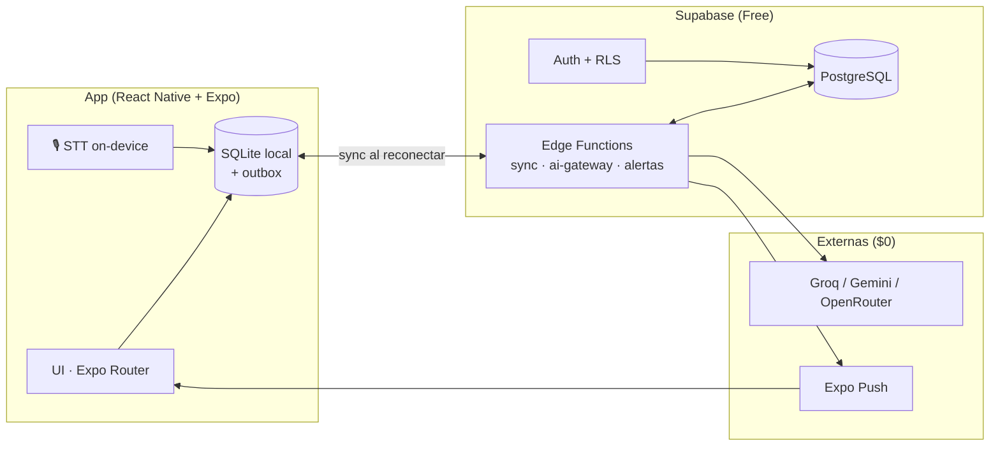

<div align="center">

# AhorRaso

**Gestión financiera personal para jóvenes y universitarios**
*Registra, controla y ahorra sin excusas — con voz, alertas y recomendaciones inteligentes.*

[](#-estado-del-proyecto)
[](#-stack-tecnol%C3%B3gico)
[](LICENSE)
[](https://expo.dev)
[](https://supabase.com)
[](https://www.typescriptlang.org)

</div>

---

## Índice

1. [Descripción del proyecto](#-descripci%C3%B3n-del-proyecto)
2. [Características](#-caracter%C3%ADsticas)
3. [Stack tecnológico](#-stack-tecnol%C3%B3gico)
4. [Arquitectura](#-arquitectura)
5. [Estructura del repositorio](#-estructura-del-repositorio)
6. [Requisitos previos](#-requisitos-previos)
7. [Puesta en marcha](#-puesta-en-marcha)
8. [Base de datos y migraciones](#-base-de-datos-y-migraciones)
9. [Scripts disponibles](#-scripts-disponibles)
10. [Pruebas](#-pruebas)
11. [Integraciones: voz e IA](#-integraciones-voz-e-ia)
12. [CI/CD y despliegue](#-cicd-y-despliegue)
13. [Estado del proyecto](#-estado-del-proyecto)
14. [Equipo](#-equipo)
15. [Documentación](#-documentaci%C3%B3n)
16. [Licencia](#-licencia)

---

## Descripción del proyecto

**AhorRaso** resuelve la ineficiencia, la falta de control presupuestal y los errores de cálculo de la gestión manual de dinero. La app permite a jóvenes y universitarios:

- Registrar ingresos y gastos en segundos — **manual o por comando de voz**.
- Visualizar el estado financiero en un dashboard que carga en **menos de 3 segundos**.
- Recibir **alertas proactivas de sobregiro** antes de que ocurra.
- Definir **presupuestos por categoría** y **metas de ahorro** con proyección.
- Obtener **recomendaciones inteligentes de ahorro** generadas por IA.

> **Restricción de diseño #1:** todo el proyecto funciona con **$0 USD** de presupuesto.
> Cada herramienta del stack es *Open Source* o cuenta con un *Free Tier* suficiente
> para desarrollar, probar y lanzar el MVP completo. Ver detalle en
> [`docs/ARQUITECTURA_TECNICA.md`](docs/ARQUITECTURA_TECNICA.md).

---

## Características

| ID | Funcionalidad | Prioridad MoSCoW | Estado |
| :-- | :--- | :--: | :--: |
| RF-001 | Registrar ingresos | Must Have | ⏳ |
| RF-002 | Registrar gastos (monto, fecha, categoría, método de pago) | Must Have | ⏳ |
| RF-003 | **Registrar gastos por voz** | Must Have | ⏳ |
| RF-004 | Categorizar movimientos | Must Have | ⏳ |
| RF-005 | Gestionar categorías personalizadas | Must Have | ⏳ |
| RF-006 | Presupuesto por categoría y periodo | Must Have | ⏳ |
| RF-007 | Metas de ahorro con fecha estimada | Should Have | ⏳ |
| RF-008 | Dashboard financiero (saldo, gastos, proyección) | Must Have | ⏳ |
| RF-009 | Historial con filtros (fecha, categoría, monto) | Must Have | ⏳ |
| RF-010/011 | Umbrales configurables y **alertas de presupuesto** | Must Have | ⏳ |
| RF-012 | Análisis de patrones de consumo | Could Have | ⏳ |
| RF-013 | **Recomendaciones de ahorro con IA** | Could Have | ⏳ |
| RF-014 | Simulación de proyección de metas | Could Have | ⏳ |
| RF-018 | Acceso con contraseña, **PIN o biometría** | Could Have | ⏳ |

**Requisitos no funcionales clave garantizados por la arquitectura:**

- **RNF-003** · Dashboard < 3 s → se sirve desde **SQLite local** (offline-first).
- **RNF-002 / RNF-005** · Seguridad y privacidad → **RLS por usuario**, claves solo en Edge Functions, PIN+biometría.
- **RNF-009 / RNF-012** · Integridad y recuperación → **outbox idempotente** + pull incremental + `pg_dump` diario.

---

## Stack Tecnológico

### Aplicación móvil
| Área | Tecnología |
| :--- | :--- |
| Framework | **React Native + Expo SDK 57** (MIT) |
| Lenguaje | **TypeScript** (`strict`) |
| Navegación | **Expo Router** (file-based routing) |
| Estado | **Zustand** (UI) · **Drizzle live queries** (datos) · **TanStack Query** (red) |
| Base de datos local | **expo-sqlite + Drizzle ORM** (offline-first) |
| UI | React Native Paper / NativeWind · **FlashList** para listas |
| Voz | **`expo-speech-recognition`** (on-device, $0) |
| Seguridad local | `expo-local-authentication` (PIN/biometría) + `expo-secure-store` |
| Notificaciones | `expo-notifications` + Expo Push (gratis) |

### Backend y servicios
| Área | Tecnología | Free Tier |
| :--- | :--- | :--- |
| BaaS | **Supabase** (Postgres + Auth + Realtime + Edge Functions) | 500 MB DB · 50.000 MAU · 5 GB egress · 500k Edge Fn/mes |
| Auth | Supabase Auth (email/contraseña, magic link, OTP) | 50.000 MAU |
| IA (Groq) | `gpt-oss` / `qwen` vía **Groq Cloud** (primario) | ~30 req/min, 1.000+ req/día |
| IA (fallback) | **Gemini API Free Tier** → **OpenRouter `:free`** | 15/10/5 RPM según modelo |
| CI/CD | **GitHub Actions** + **EAS Build/Update** | 2.000 min (∞ en repo público) + 30 builds/mes |
| Observabilidad | **PostHog** (analytics + errores + session replay) | 1M eventos/mes · 100k excepciones/mes |
| Monitoreo | UptimeRobot | 50 monitores |

<details>
<summary><b>💡 ¿Por qué este stack y no otro?</b></summary>

- **Supabase > Firebase** para este caso: el modelo relacional con *Row Level Security* en SQL encaja perfecto con consultas agregadas de presupuestos y garantiza el aislamiento de datos (RNF-005).
- **Expo > Flutter** para este equipo: un solo lenguaje (TS) con el backend, builds iOS en la nube sin Mac ni licencia de desarrollador, y actualizaciones OTA sin pasar por la tienda.
- **SQLite local > consultar la API en cada pantalla**: es lo que hace cumplir el *< 3 s* del dashboard y el modo sin conexión.
- **IA vía Edge Function**: las API keys nunca viajan en el bundle de la app, y se aíslan los *rate limits* detrás de un gateway con cache, cuotas por usuario y fallback determinista.

</details>

---

## Arquitectura

**Patrón:** *Feature-First + Clean Architecture ligera* con estrategia **offline-first**.



**Flujo de escritura (garantía offline):**

1. El usuario registra un gasto → se escribe en **SQLite** + en la tabla **`outbox`** (< 50 ms).
2. El dashboard lo muestra **de inmediato**, haya o no internet.
3. Al reconectarse, el **motor de sync** drena el outbox en lotes idempotentes (UUID del cliente) hacia Supabase.
4. Se descambian los cambios remotos con un pull incremental (`updated_at > last_sync`) y la UI se actualiza sola mediante *live queries*.

Diagramas completos (secuencia de sync, pipeline de voz, gateway de IA):
[`docs/ARQUITECTURA_TECNICA.md`](docs/ARQUITECTURA_TECNICA.md)

---

## Estructura del repositorio

```
AhorRaso/
├── .github/
│   ├── ISSUE_TEMPLATE/        # Plantillas de HU y requisitos funcionales
│   └── workflows/             # ci.yml · keep-alive.yml · backup.yml
├── apps/
│   └── mobile/                # App Expo
│       ├── src/app/           #   Rutas (Expo Router)
│       ├── src/features/      #   transactions · budgets · goals · dashboard · alerts
│       ├── src/core/          #   db · sync · auth · ai · voice · ui
│       └── src/shared/        #   utilidades puras
├── supabase/
│   ├── migrations/            # SQL versionado (esquema + RLS)
│   └── functions/             # sync-engine · ai-gateway · budget-alerts · export
├── docs/
│   ├── ARQUITECTURA_TECNICA.md
│   └── OPERACIONES.md
├── RESUMEN_PROYECTO.md        # Catálogo de requisitos y clasificación MoSCoW
└── README.md
```

---

## Requisitos previos

| Herramienta | Versión | Nota |
| :--- | :--- | :--- |
| **Node.js** | ≥ 20 LTS | <https://nodejs.org> |
| **npm** | ≥ 10 | o `pnpm`/`yarn` a elección |
| **Git** | ≥ 2.40 | |
| **Supabase CLI** | última | `npm i -g supabase` |
| **Expo CLI** | incluida (`npx expo`) | `npm i -g eas-cli` para builds en la nube |
| Android Studio | solo Android | Opcional: emulador. **Los builds se pueden hacer en la nube** |
| Xcode | solo iOS | Opcional: simulador en macOS |
| Java JDK | 17+ | Solo necesario para build local de Android |

---

## Puesta en marcha

> Los pasos aplican una vez ejecutado el *scaffolding* de la app (**Sprint 0**).
> El esquema de comandos sigue el estándar de Expo + Supabase CLI.

```bash
# 1. Clonar
git clone https://github.com/<org>/AhorRaso.git
cd AhorRaso

# 2. Instalar dependencias
npm install

# 3. Variables de entorno
cp .env.example .env
#   EXPO_PUBLIC_SUPABASE_URL=...
#   EXPO_PUBLIC_SUPABASE_ANON_KEY=...
#   Las claves de IA (GROQ_API_KEY, GEMINI_API_KEY) van SOLO en
#      Supabase Secrets, nunca en .env de la app.

# 4.Levantar Supabase local (opcional pero recomendado en dev)
supabase start
supabase db reset

# 5. Ejecutar la app
npx expo start              # Expo Go (funcionalidades sin módulos nativos)
npx expo run:android        # development build (requerido para VOZ y BIOMETRÍA)
npx expo run:ios            # development build iOS (requiere macOS)
```

> **Importante:** las funciones de **voz** y **biometría** usan módulos nativos,
> por lo que necesitan un *development build* (`expo-dev-client`), no Expo Go.
> En la nube: `eas build --platform android --profile development`.

---

## Base de datos y migraciones

```bash
supabase migration new add_transactions   # crea archivo SQL
# ... escribir el DDL ...
supabase db reset                          # aplicar en local
supabase db push                           # aplicar en remoto (producción)
```

**Convenciones obligatorias:**

- Toda tabla nueva lleva `user_id uuid NOT NULL REFERENCES auth.users(id)` y su **política RLS**:
  ```sql
  ALTER TABLE transactions ENABLE ROW LEVEL SECURITY;
  CREATE POLICY own_rows ON transactions
    FOR ALL USING (auth.uid() = user_id)
    WITH CHECK (auth.uid() = user_id);
  ```
- Índices compuestos para el dashboard: `(user_id, occurred_on DESC)` y `(user_id, updated_at)` para el sync pull.
- IDs generados en el **cliente** (UUIDv4) para que las escrituras offline sean idempotentes.
- Nunca editar el schema desde el dashboard en producción: solo migraciones versionadas.

---

## Scripts disponibles

| Comando | Descripción |
| :--- | :--- |
| `npm run start` | Inicia el servidor de desarrollo de Expo |
| `npm run android` / `npm run ios` | Ejecuta en emulador/dispositivo |
| `npm run lint` | ESLint + reglas de convención |
| `npm run typecheck` | `tsc --noEmit` |
| `npm test` | Suite de pruebas unitarias (Jest) |
| `npm run test:coverage` | Cobertura con reporte |
| `npm run test:e2e` | Pruebas E2E con Maestro |
| `npm run db:migrate` | Aplica migraciones de Supabase en local |
| `npm run build:preview` | `eas build -p android --profile preview` (APK interno) |

> ℹEstos scripts se habilitan con el *scaffolding* del monorepo (**Sprint 0**).
> Mientras tanto el repositorio contiene la fase de planificación: catálogo de
> requisitos, plantillas de issues y arquitectura. Ver [Estado del proyecto](#-estado-del-proyecto).

---

## Pruebas

| Nivel | Herramienta | Objetivo |
| :--- | :--- | :--- |
| Unitarias | **Jest** + `ts-jest` | Lógica de `domain/` (cálculos, validaciones, parser de voz) — cobertura objetivo ≥ 70 % |
| Componentes | **React Native Testing Library** | Interacción de formularios y listas |
| Integración | Jest + **Supabase local** | Políticas RLS (usuario A no lee datos de usuario B) |
| E2E | **Maestro** (YAML, gratis) | Flujos críticos: login → gasto → dashboard → alerta |
| Sync | Tests de idempotencia | Reenvío del mismo outbox no duplica registros |

```bash
npm test                  # unitarias
npm run test:e2e          # Maestro (emulador corriendo)
```

---

## Integraciones: voz e IA

### Voz (RF-003) — $0
1. `expo-speech-recognition` transcribe con los servicios **on-device** del sistema (SFSpeechRecognizer / Android SpeechRecognizer).
2. Un parser local con regex extrae monto, categoría y fecha (resuelve la mayoría de casos **sin llamada a IA**).
3. Solo si la confianza es baja se consulta el **AI Gateway** para estructurar el gasto.
4. El usuario **confirma** antes de guardar (evita registros erróneos).

### IA (RF-012 / RF-013) — $0
- Toda llamada pasa por `supabase/functions/ai-gateway`: verifica JWT → aplica cuota por usuario → busca en **cache** → llama a **Groq** → si falla **Gemini** → si falla **OpenRouter** → si todos fallan, **respuesta determinista local**.
- El análisis de patrones (RF-012) se calcula con SQL/estadística local: la IA solo redacta la recomendación (RF-013), así el free tier nunca es cuello de botella.

---

## Documentación

| Documento | Contenido |
| :--- | :--- |
| [`docs/ARQUITECTURA_TECNICA.md`](docs/ARQUITECTURA_TECNICA.md) | Stack completo, límites de free tier, diagramas, offline-first, RNF, despliegue y riesgos |
| [`docs/OPERACIONES.md`](docs/OPERACIONES.md) | Runbook: keep-alive, backups, migraciones, secretos, monitoreo e incidentes |
| [`RESUMEN_PROYECTO.md`](RESUMEN_PROYECTO.md) | Catálogo de requisitos RF/RNF y clasificación MoSCoW |
| `.github/ISSUE_TEMPLATE/` | Plantillas de Historia de Usuario y Requisito Funcional |

---

## Costo total del proyecto

| Concepto | Costo |
| :--- | :--- |
| Desarrollo, builds, backend, IA, CI/CD, monitoreo | **$0 USD** |
| Publicación en Google Play (opcional) | USD 25 — pago único |
| Publicación en App Store (opcional) | USD 99/año |
