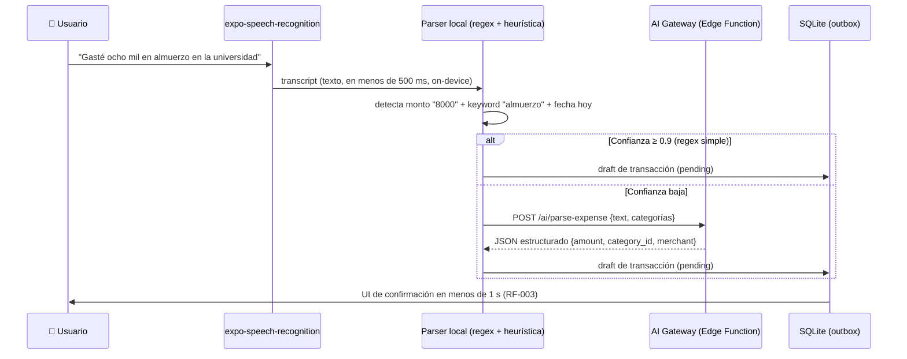
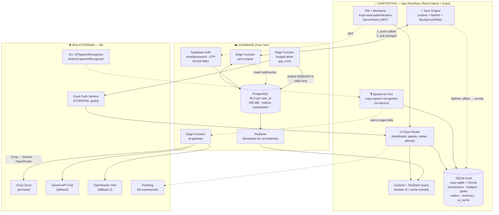
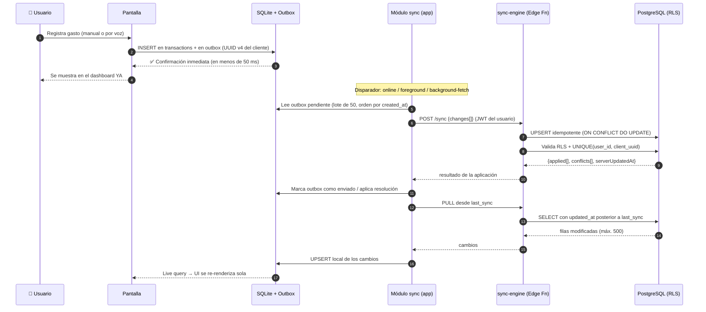

# AhorRaso — Documento de Arquitectura Técnica

| Campo | Valor |
| :--- | :--- |
| **Proyecto** | AhorRaso — Gestión financiera personal para jóvenes y universitarios |
| **Versión del documento** | 1.0 |
| **Rol autor** | Arquitecto de Software Mobile / Tech Lead |
| **Equipo objetivo** | 3 desarrolladores full-stack |
| **Restricción de presupuesto** | **$0 USD** — 100 % herramientas Open Source o Free Tier |
| **Alcance de fase** | MVP (sprints 1..N), previo a producción masiva |

---

## 0. Resumen ejecutivo y decisiones clave (ADRs resumidos)

| # | Decisión | Elección | Por qué (versión corta) |
| :-- | :--- | :--- | :--- |
| ADR-001 | Framework móvil | **React Native + Expo (SDK 57) + TypeScript** | Un solo lenguaje (TS) para app, tipos compartidos con Supabase y Edge Functions; builds en la nube sin Mac ni licencias; OTA updates para parches sin pasar por tienda. |
| ADR-002 | Backend / BaaS | **Supabase (Free Plan)** | Postgres real + RLS + Auth + Realtime + Edge Functions en un solo plan gratuito muy generoso (500 MB DB, 50.000 MAU). |
| ADR-003 | Persistencia local | **expo-sqlite + Drizzle ORM** (offline-first) | SQLite nativo vía JSI (síncrono, rápido), migraciones versionadas y live queries; la app **nunca depende de la red** para leer/escribir. |
| ADR-004 | Estado global | **Zustand** (UI/sesión) + **Drizzle live queries** (datos) + **TanStack Query** (solo APIs externas) | Evita el boilerplate de Redux manteniendo devtools; los datos viven en SQLite, no en memoria. |
| ADR-005 | Voz (RF-003) | **`expo-speech-recognition`** (on-device, SFSpeechRecognizer / Android SpeechRecognizer) | $0, sin enviar audio a terceros, funciona con latencia mínima. |
| ADR-006 | IA (RF-012/013) | **Gateway propio en Supabase Edge Function → Groq (primario) / Gemini (fallback)** | Las claves nunca salen del backend; se encapsulan rate-limits, cache y fallback determinista. |
| ADR-007 | CI/CD | **GitHub Actions + EAS Build + EAS Update** | 2.000 min/mes de CI + 30 builds/mes + OTA a 1.000 MAU = $0. |
| ADR-008 | Observabilidad | **PostHog** (analytics + error tracking + session replay) | 1M eventos/mes, 100k excepciones/mes, miembros ilimitados, sin tarjeta. |

**Tesis de arquitectura:** *local-first con sincronización diferida*. SQLite es la fuente de verdad de lectura en el dispositivo; Supabase es la fuente de verdad de la nube. Toda escritura pasa por un **outbox** que se drena cuando hay conectividad. Esto cumple de forma nativa **RNF-009**, **RNF-012** y el **RNF-003 (<3 s)** porque el dashboard se calcula sobre datos locales.

---

## 1. Stack Tecnológico Principal (100 % gratuito)

### 1.1 Desarrollo Móvil (Frontend)

**Elección: React Native + Expo (Expo SDK 57) + TypeScript + Expo Router.**

| Capa | Herramienta | Licencia / Costo | Justificación |
| :--- | :--- | :--- | :--- |
| Runtime móvil | **React Native** (núcleo Meta, MIT) | $0 | Código único para Android/iOS/Web, ecosistema de librerías más grande del mercado RN. |
| Toolchain | **Expo SDK** (MIT) + **Expo CLI** | $0 | Maneja el ciclo nativo con *Continuous Native Generation*: **no se necesita Xcode ni Android Studio** para compilar en la nube. |
| Builds en la nube | **EAS Build** (plan Free) | $0 | **15 builds Android + 15 builds iOS al mes**, cola de baja prioridad, timeout 45 min, 1 build concurrente, *Submit* a tiendas incluido. |
| Updates OTA | **EAS Update** (plan Free) | $0 | Parches JS sin pasar por la tienda: **1.000 MAU/mes**, 100.000 eventos de telemetry/mes. |
| Navegación | **Expo Router** (file-based, tipo Next.js) | $0 | Rutas tipadas, deep links y code-splitting fuera de la caja. |
| UI | **React Native Paper** o **NativeWind (Tailwind)** + **Shopify FlashList** | $0 | Componentes Material 3 accesibles (RNF-011) y listas de 60 fps para el historial. |
| Gráficos | **Victory Native** o **react-native-svg + Gifted Charts** | $0 | Dashboard con donas/barras de gastos por categoría sin librerías propietarias. |
| Lenguaje | **TypeScript** (strict) | $0 | Tipos compartidos con `supabase gen types typescript` → cero desfases API↔UI. |

**¿Por qué Expo/RN y no Flutter?** Ambos son $0. RN gana en este proyecto por: (a) un solo lenguaje con el backend Edge Functions y los tipos de Postgres; (b) `expo-speech-recognition` y `expo-local-authentication` ya envuelven los APIs de voz/biometría; (c) EAS Build permite compilar iOS desde Windows/Linux sin Mac ni licencia; (d) el equipo puede reutilizar librerías JS existentes. Flutter sería igualmente válido si el equipo ya dominara Dart.

**Costos de desarrollador (fuera del stack, únicos gastos reales):**

| Item | Costo | ¿Necesario para el MVP? |
| :--- | :--- | :--- |
| Google Play Console | USD 25 (pago único) | Solo para publicar en Play Store. Mientras tanto: **APK compartido / Internal Testing = $0**. |
| Apple Developer Program | USD 99/año | Solo para iPhone físico, TestFlight y App Store. **Alternativa $0**: simulador iOS + EAS Build local con Apple ID gratuito (firmas de 7 días). |
| Dominio web | USD 0 | DNS y hosting vía Vercel/Cloudflare Pages Free. |

> **Conclusión:** el MVP se desarrolla, compila y prueba en Android físico + iOS simulador con **$0 USD exactos**. La publicación en tiendas es una decisión de negocio posterior (75 % de los costos son de Google/Apple, no de tecnología).

### 1.2 Backend / BaaS (Backend as a Service)

**Elección: Supabase — Free Plan.**

| Recurso | Límite Free Tier (verificado) | Implicación para AhorRaso |
| :--- | :--- | :--- |
| Base de datos | **500 MB** (CPU compartida, 500 MB RAM) | Un usuario genera ~2 KB/mes en transacciones → decenas de miles de usuarios caben. |
| Peticiones API | **Ilimitadas** (PostgREST) | El sync outbox nunca se corta por peticiones. |
| Egress | **5 GB + 5 GB cacheados / mes** | Suficiente si el cliente pagina y cachea localmente. |
| Auth | **50.000 MAU** | Muy por encima de cualquier MVP universitario. |
| Edge Functions | **500.000 invocaciones/mes** | Alertas (RF-011) + gateway de IA (RF-012/013) + sync entrantes sin costo. |
| Realtime | 2M mensajes / 200 conexiones pico | Sync incremental y notificaciones in-app. |
| Storage | 1 GB (avatares, exportes PDF/CSV) | Exportación de reportes. |
| Proyectos | 2 activos (dev + prod) | — |
| **⚠️ Trampa operativa** | **Los proyectos Free se pausan tras 1 semana de inactividad** | Mitigación obligatoria: *keep-alive* semanal (ver §5.4). |

**Alternativas evaluadas:**

| BaaS | Free Tier | Por qué no (o cuándo sí) |
| :--- | :--- | :--- |
| **Firebase (Spark)** | Auth 50k MAU, Firestore 1 GiB / 50k lecturas-día, Functions 125K invocaciones-día | Muy generoso, pero NoSQL impide consultas agregadas complejas de presupuestos y no tiene RLS tipado en SQL. Queda como plan B. |
| **Appwrite Cloud (Free)** | 75k MAU, 2 GB storage, 5 GB bandwidth, 750k ejecuciones, **500k reads / 250k writes por mes**, 1 DB/1 bucket/2 functions por proyecto, se pausa tras 1 semana | Open source y sólido, pero las **500k lecturas/mes** son el cuello de botella real para una app de sync constante. **Plan B si Supabase falla.** |
| **Appwrite self-hosted / Pocketbase / NocoDB** | $0 licencia | Requiere un servidor (Oracle Cloud Always Free / VM universitaria) → añade operación 24/7 que un equipo de 3 no puede cubrir. Descartado para el MVP. |

**Decisión:** Supabase como backend único; el modelo relacional con **Row Level Security** es exactamente lo que pide RNF-005 y permite al cliente hablar con Postgres directamente (menos código que un REST API propio).

### 1.3 Base de Datos, Persistencia y Caché Offline

**Estrategia de doble base de datos (local + nube):**

```
┌─ Dispositivo ─────────────────────┐   ┌─ Nube ──────────────────────┐
│ SQLite (expo-sqlite + Drizzle)    │◄──┤ PostgreSQL 16 (Supabase)    │
│  • transactions (espejo local)    │   │  • Tabla canónica + índices  │
│  • categories, budgets, goals     │   │  • RLS por user_id           │
│  • outbox (escrituras pendientes) │   │  • Migraciones con CLI       │
│  • dashboard_summary (agregados)  │   │  • Backups: pg_dump diario   │
│  • ai_cache (respuestas IA)       │   └──────────────────────────────┘
├─ Claves/secretos ─────────────────┤
│ expo-secure-store (Keychain/Keystore): JWT, PIN hash, salt, API key local │
├─ Prefs ligeras ───────────────────┤
│ AsyncStorage: flags de UI, onboarding, últimos filtros                   │
└───────────────────────────────────┘
```

| Necesidad | Herramienta | Costo | Nota técnica |
| :--- | :--- | :--- | :--- |
| DB local | **expo-sqlite** (JSI, síncrono) | $0 | `openDatabaseSync(..., { enableChangeListener: true })` habilita *live queries*. |
| ORM local | **Drizzle ORM** (`drizzle-orm/expo-sqlite`) + `drizzle-kit` | $0 | Migraciones SQL generadas y empaquetadas en el bundle; tipos compartidos con el schema. |
| Live queries | `useLiveQuery()` de Drizzle | $0 | La UI se re-renderiza sola al escribir en SQLite: sin `useEffect` de refetch. |
| Alternativa (si >10k filas y sync muy frecuente) | **WatermelonDB** (@nozbe) | $0 | Lazy loading y queries en hilo nativo. Requiere *dev build* (no Expo Go). Decidir en Sprint 3 si el historial crece mucho. |
| Claves/token | **expo-secure-store** | $0 | Keychain (iOS) / Keystore (Android) con cifrado hardware. |
| Prefs | **AsyncStorage** | $0 | Solo preferencias no sensibles. |
| Caché de red | **TanStack Query** (`staleTime`, `persistQueryClient`) | $0 | Únicamente para respuestas de IA y catálogo remoto. |

**Estrategia de respaldo (RNF-012):** Supabase Free **no incluye backups automáticos**. Solución $0: *GitHub Actions cron* que ejecuta `pg_dump` vía `supabase db dump` y sube el archivo cifrado a Supabase Storage (1 GB incluidos) / artefactos de Actions. Retención: 7 dumps diarios + 1 semanal.

### 1.4 Autenticación y Seguridad

| Capa | Solución | Costo | Detalle |
| :--- | :--- | :--- | :--- |
| Cuenta (nube) | **Supabase Auth** (email + contraseña, magic link, OTP) | $0 (50k MAU) | JWT firmado, refresh token rotativo, sesiones multi-dispositivo. |
| Bloqueo de app (local) | **PIN 4/6 dígitos + biometría** (`expo-local-authentication`) | $0 | Autenticación *offline* garantizada; el PIN nunca se almacena en claro: `PBKDF2/scrypt` con salt vía `expo-crypto`. |
| Bloqueo biométrico | `LocalAuthentication.hasHardwareAsync()` + `requireAuthenticationAsync()` para escrituras sensibles | $0 | FaceID/TouchID/ huella Android. |
| Sesión persistente | JWT + refresh en **SecureStore** | $0 | Nunca en AsyncStorage. |
| Aislamiento de datos | **RLS en todas las tablas** (`auth.uid() = user_id`) | $0 | Cumple RNF-005 por diseño: es imposible leer datos de otro usuario aunque se filtre la anon key. |
| API keys de IA | **Supabase Secrets** (`supabase secrets set`) solo en Edge Functions | $0 | **Nunca** en el bundle móvil. |

---

## 2. Estrategia de Integraciones y APIs Externas (Costo $0)

### 2.1 Reconocimiento de voz — RF-003

**Elección principal: `expo-speech-recognition` (npm, MIT)** — envuelve nativamente:

- **iOS:** `SFSpeechRecognizer` (on-device con `requiresOnDeviceRecognition: true`).
- **Android:** `SpeechRecognizer` del sistema (servicio Google / `com.google.android.as` on-device).
- **Web:** `SpeechRecognition`/`webkitSpeechRecognition` → sirve para el build web (RNF-006).

Costo: **$0** (API del sistema operativo, sin cuotas). Requiere **development build** (no corre en Expo Go) → `npx expo run:android` o EAS Build.

**Pipeline técnico del gasto por voz:**



**Reglas de contención de costo y latencia:**

1. **Primero heurística local, la IA solo como fallback.** El 80 % de los dictados ("gasté 12.500 en taxi") se resuelven con regex en < 5 ms y **cero llamadas a LLM**. Esto protege los rate-limits descritos en §2.2.
2. **Confirmación humana obligatoria**: el gasto nunca se persiste sin que el usuario confirme el monto/categoría (evita errores RNF-009).
3. **Fallbacks**: si el reconocimiento on-device falla → modo *network* del SO; si falla → **campo de texto con autocompletado** (el flujo nunca se bloquea).
4. **Privacidad**: con `requiresOnDeviceRecognition: true` el audio no sale del dispositivo → ventaja de RNF-002/RNF-005 y se omite el permiso de red de Apple.
5. **Alternativa 100 % offline sin servicios del SO:** `vosk-android` / `whisper.cpp` (ambos open source) como *plan B* si un fabricante bloquea el SpeechRecognizer. Costo $0, tamaño de modelo ~40 MB.

**Permisos:** `RECORD_AUDIO` (Android), `NSMicrophoneUsageDescription` + `NSSpeechRecognitionUsageDescription` (iOS) — textos claros, requisito de App Store (RNF-011/privacidad).

### 2.2 Análisis de IA y Recomendaciones — RF-012 y RF-013

**Elección: Supabase Edge Function (`/ai/*`) como *AI Gateway* único, con Groq como proveedor primario y Gemini como fallback.**

| Proveedor | Modelo (ejemplo) | Free Tier verificado | Rol en AhorRaso |
| :--- | :--- | :--- | :--- |
| **Groq Cloud** | `openai/gpt-oss-120b`, `qwen/qwen3.8-27b` | **~30 req/min**, **1.000–14.400 req/día** según modelo; ~6.000–12.000 tokens/min; sin tarjeta | **Primario**: respuestas <300 ms, ideal para análisis en vivo. |
| **Google Gemini API (AI Studio)** | `gemini-2.5-flash-lite` / `gemini-2.5-flash` | Flash-Lite ≈ **15 RPM / 1.000 req/día**; Flash ≈ **10 RPM / 250 req/día**; Pro ≈ 5 RPM / 100 req/día (sin tarjeta) | **Fallback** y tareas batch (informe semanal). ⚠️ En Free Tier Google puede usar los prompts para mejorar sus productos. |
| **OpenRouter** | modelos `:free` (20+ disponibles) | **20 req/min**, **50 req/día** (o 1.000/día con $10 de crédito único) | **Tercer fallback** / prueba de modelos alternativos vía un solo endpoint. |

> Los límites de free tier cambian con frecuencia: centralizar la llamada en **una sola función** (`aiGateway`) permite cambiar de proveedor **sin tocar la app**. Verificar siempre en la consola del proveedor.

**Diseño del gateway (patrón anti-quota-exhaustion):**

```ts
// supabase/functions/ai-gateway/index.ts  (Deno, Edge Function - 500k invocaciones/mes)
// 1. Auth: verificar JWT y extraer user_id
// 2. Rate-limit por usuario: tabla ai_usage(user_id, day, count) — ej. 20 req/día/usuario
// 3. Cache: SELECT de ai_cache WHERE hash(prompt) AND created_at > now() - '7 days'
// 4. Proveedor: Groq → (429/timeout) → Gemini → (429/timeout) → OpenRouter
// 5. Si todos fallan: FALLBACK_DETERMINISTA (reglas + SQL agregado), nunca error al usuario
// 6. Registrar consumo en ai_usage + escribir en ai_cache
```

**Capas de protección de cuota (todas obligatorias):**

| # | Mecanismo | Efecto |
| :-- | :--- | :--- |
| 1 | **Fallback determinista local**: análisis de patrones (RF-012) resuelto con SQL/estadística local (mediana, desviación, % por categoría, tendencia 3 meses) | **RF-012 se cumple sin LLM**. La IA solo "humaniza" el texto (RF-013). |
| 2 | **Cache semántico de 7 días** por usuario+tipo de informe | Reduce llamadas repetidas del dashboard en ~70 %. |
| 3 | **Cuota por usuario** (`ai_usage`) + **cuota global diaria** en Edge Function | Un usuario no puede agotar la cuota del equipo. |
| 4 | **Batch programado**: informe semanal generado 1× por usuario con `pg_cron`, no on-demand | Convierte N llamadas en 1. |
| 5 | **Circuit breaker + exponential backoff** con `Retry-After` | Evita *retries* que consumen cuota (OpenRouter cobra igual las peticiones fallidas). |
| 6 | **JSON Schema / `response_format: json_object`** y `max_tokens` acotados (~300) | Prompt de entrada ~400 tokens, salida ~250 → miles de recomendaciones por día dentro del free tier. |
| 7 | **No enviar datos personales identificables**: solo agregados numéricos anónimos | Privacidad (RNF-005) + cumple ToS de los proveedores. |

**Ejemplo de presupuesto de cuota (MVP con 500 usuarios activos):**

```
Llamadas IA reales/día ≈ 500 usuarios × 1,5 llamadas × 30 % cache-hit
                       ≈ 525 → 370 llamadas efectivas/día
Groq Free (mínimo)     = 1.000 req/día  ✅ con holgura 2,7×
Gemini Free (fallback) =   250 req/día  ✅ absorbe picos
OpenRouter Free        =    50 req/día  ✅ tercer nivel
Costo total            = $0 USD
```

---

## 3. Arquitectura del Sistema y Patrones de Diseño

### 3.1 Patrón de arquitectura frontend

**Feature-First + Clean Architecture ligera (3 capas por feature) + estado global desacoplado.**

```
src/
├── app/                      # Expo Router (rutas = archivos)
│   ├── (auth)/login.tsx
│   └── (tabs)/dashboard.tsx
├── core/                     # Código transversal SIN dependencias de UI
│   ├── db/                   #   cliente Drizzle, schema, migraciones, live queries
│   ├── sync/                 #   outbox, motor de sync, resolución de conflictos
│   ├── auth/                 #   supabase auth + PIN/biometría
│   ├── ai/                   #   cliente del AI Gateway (typed)
│   ├── voice/                #   wrapper de speech-to-text + parser
│   └── ui/                   #   theme, componentes base
├── features/                 # ← unidad de trabajo del equipo
│   ├── transactions/
│   │   ├── ui/               #   pantallas y componentes
│   │   ├── data/             #   repositorios (leen de SQLite SIEMPRE)
│   │   └── domain/           #   casos de uso, validaciones, tipos
│   ├── budgets/  goals/  dashboard/  categories/  alerts/
└── shared/                   # utilidades puras (formato moneda, fechas, tests)
```

**Reglas de dependencia (Clean Architecture):**

1. `ui → domain → data` — **nunca** al inverso. La UI jamás llama a Supabase directamente: llama a un repositorio que escribe/lee en **SQLite**.
2. `domain` es puro TypeScript (sin React, sin SQLite, sin fetch) → testeable con Jest sin mocks.
3. Solo `core/sync` habla con Supabase. Esto hace que **migrar de BaaS toque un solo módulo**.

**Manejo de estado:**

| Tipo de estado | Herramienta | Ejemplo |
| :--- | :--- | :--- |
| Datos persistentes (dominio) | **Drizzle live queries sobre SQLite** | Lista de transacciones, saldos, progreso de metas. |
| Estado de UI / sesión | **Zustand** (con `persist` a AsyncStorage) | Pestaña activa, filtros, onboarding, estado `isLocked`. |
| Estado remoto / APIs externas | **TanStack Query** (solo red) | Respuestas del AI Gateway, sync status. |
| Formularios | **react-hook-form + zod** | Validación de montos, fechas, categorías. |

¿Por qué no Redux Toolkit? Porque con SQLite como fuente de verdad, la mitad del store sería un espejo duplicado; Zustand entrega lo mismo en ~1 kB. Se mantiene **Redux DevTools-compatible** vía middleware de Zustand si se necesita depurar.

### 3.2 Diagrama de arquitectura general



### 3.3 Secuencia: Offline-First & Sync (RNF-009, RNF-012)



**Especificación del motor de sync:**

| Aspecto | Diseño |
| :--- | :--- |
| **Modelo** | *Outbox + pull incremental*. Toda escritura local se duplica en `outbox(id, entity, op, payload, retries, created_at)`. |
| **Identidad** | UUIDv4 generado en el cliente → la escritura es **idempotente** (reintentos seguros, sin duplicados ⇒ cumple **RNF-009**). |
| **Push** | Drenaje en lote (50 registros) vía Edge Function; `ON CONFLICT (client_uuid) DO NOTHING`. |
| **Pull** | `WHERE updated_at > :last_sync ORDER BY updated_at LIMIT 500` con cursor (keyset pagination). |
| **Relojes** | `client_updated_at` (dispositivo) + `updated_at` (servidor, autoritativo). Se evita reloj de pasos usando el servidor como verdad. |
| **Conflictos** | **Last-Write-Wins por `client_updated_at`**; los *borrados* usan `deleted_at` (soft delete) para propagar. Bitácora `sync_log` para auditoría. |
| **Disparadores** | 1) evento `NetInfo` a *online*; 2) `AppState` a *foreground*; 3) `expo-background-fetch` cada 15 min; 4) al registrar un movimiento. |
| **Backoff** | 1 s → 5 s → 30 s → 5 min con jitter; máximo 10 reintentos y luego se notifica al usuario con badge "pendiente de sincronizar". |
| **Garantía** | El outbox sobrevive a reinicios (está en SQLite) ⇒ **nunca se pierde un gasto** (RNF-012). |
| **Alcance de descarga** | Últimos 90 días + metas/presupuestos activos (el histórico completo se baja perezosamente, bajo demanda). |

### 3.4 Patrón de backend

- **Postgres + RLS** como API: el cliente usa `@supabase/supabase-js` con políticas `USING (auth.uid() = user_id)`. Cero endpoints CRUD manuales → menos superficie de ataque y menos código.
- **Edge Functions (Deno)** solo para lo que Postgres no puede hacer solo: `sync-engine`, `ai-gateway`, `budget-alerts`, `export-report`.
- **Migraciones** versionadas con Supabase CLI (`supabase migration new` → SQL en `supabase/migrations/`), aplicadas en CI. **Nunca** modificar schema desde el dashboard en producción.
- **Realtime** para: badge de "sincronizado", alertas in-app y multi-dispositivo del mismo usuario.

---

## 4. Estrategia para Requisitos No Funcionales Clave

### 4.1 Rendimiento — Dashboard < 3 segundos (RNF-003)

**Presupuesto de tiempo del arranque en frío:**

| Fase | Objetivo | Estrategia |
| :--- | :--- | :--- |
| Splash + migrations SQLite | < 300 ms | Migraciones incrementales versionadas (no recrear la DB). |
| Pintado inicial (UI shell) | < 400 ms | `expo-router` con `ActivityIndicator` + **skeletons**, nunca pantalla en blanco. |
| Datos del dashboard | < 150 ms | **Todo se lee de SQLite local** (JSI síncrono), cero await de red. |
| Gráficas | < 300 ms | Datos pre-agregados en `dashboard_summary`; FlashList con `estimatedItemSize`. |
| **Total** | **< 1,2 s** (objetivo real vs. 3 s exigidos) | Margen de seguridad para gama baja. |

**Tácticas concretas:**

1. **Vista materializada local**: tabla `dashboard_summary(day, user_id, income, expense, by_category jsonb)` recalculada por trigger de SQLite al insertar. El dashboard hace **1 SELECT** en lugar de 6 agregaciones.
2. **Índices obligatorios** (Postgres y SQLite):
   ```sql
   CREATE INDEX idx_tx_user_date   ON transactions (user_id, occurred_on DESC);
   CREATE INDEX idx_tx_user_cat    ON transactions (user_id, category_id, occurred_on DESC);
   CREATE INDEX idx_budget_user_p  ON budgets (user_id, period_start);
   CREATE INDEX idx_tx_updated     ON transactions (user_id, updated_at);  -- sync pull
   ```
3. **Paginación keyset** (`WHERE occurred_on < :cursor ORDER BY occurred_on DESC LIMIT 20`) en historial → nunca cargar 10k filas. FlashList virtualiza.
4. **Consultas selectivas**: `SELECT id, amount, category_id` (nunca `SELECT *`); agregados en Postgres con `SUM/COUNT` en servidor solo cuando se necesita recalcular.
5. **Sin N+1**: categorías se cargan en un solo `IN (...)` y se cachean en memoria por sesión.
6. **Bundle**: `expo export` con `experiments.treeShaking`, imágenes optimizadas y `metro.config` con `assetBundlePatterns` → objetivo < 15 MB en descarga.
7. **Medición real**: PostHog capturea `time_to_dashboard_ms` en cada arranque → alerta si p90 > 3.000 ms (RNF-003 verificable, no solo prometido).

### 4.2 Seguridad y Privacidad (RNF-002, RNF-005)

**a) Variables de entorno y secretos**

```
# .env (cliente — NUNCA secretos reales; todo lo que empiece con EXPO_PUBLIC_ se inyecta en el bundle)
EXPO_PUBLIC_SUPABASE_URL=https://xxxx.supabase.co
EXPO_PUBLIC_SUPABASE_ANON_KEY=eyJhbG...        # pública por diseño: la protege RLS
EXPO_PUBLIC_ENV=development

# Supabase Secrets (solo Edge Functions, fuera del bundle)
GROQ_API_KEY=...
GEMINI_API_KEY=...
OPENROUTER_API_KEY=...
```

- `.env` está en `.gitignore`; se versiona `.env.example`.
- **Regla dura**: ninguna API key de IA ni service role key en el código móvil. Se audita con `npx expo-doctor` + grep en CI (`grep -r "sk-\|gsk_\|SERVICE_ROLE" src/ && exit 1`).
- Rotación de claves documentada en `docs/OPERACIONES.md`.

**b) Aislamiento RLS (RNF-005)**

```sql
ALTER TABLE transactions ENABLE ROW LEVEL SECURITY;

CREATE POLICY transactions_own_rows ON transactions
  FOR ALL
  USING (auth.uid() = user_id)
  WITH CHECK (auth.uid() = user_id);

-- Toda tabla naciente lleva su política; se prueba con pgTAP/test de integración:
-- 1) crear usuario A y B, 2) insertar con A, 3) leer con B → debe volver 0 filas.
```

- La **anon key** es pública por diseño: sin RLS correcta sería un desastre → **las políticas son el primer test de integración**.
- Vistas/RPC siempre `SECURITY DEFINER` con `SET search_path = public` y validación de `auth.uid()`.
- `service_role` solo en Edge Functions (nunca en el cliente).

**c) Datos en el dispositivo**

| Nivel | Medida |
| :--- | :--- |
| Almacenamiento en reposo | Cifrado **file-based encryption** del SO (iOS Data Protection / Android FBE) activo por defecto. |
| Dato sensible adicional | `pin_hash` (PBKDF2+salt), tokens y saldos críticos cifrados con clave derivada del **Keystore/Keychain** (no en la DB en claro). |
| Opción reforzada | Si el threat model lo exige: driver **SQLCipher** (AES-256) sobre SQLite — evaluar en Sprint 4 (costo $0, complejidad media). |
| Capturas de pantalla / app switcher | `expo-keep-secure` / blur en pantalla de bloqueo; flags `FLAG_SECURE` en Android. |
| Transporte | TLS obligatorio (HTTPS de Supabase); certificate pinning opcional con `react-native-ssl-pinning`. |
| Validación de entradas | `zod` en cliente **y** `CHECK`/`NOT NULL` en Postgres (nunca confiar solo en el cliente). |
| Auditoría de dependencias | `npm audit` + Dependabot alerts en CI (gratis en GitHub). |

**d) Privacidad y cumplimiento**

- Mínimo dato recolectado: sin contactos, sin ubicación, sin micrófono en segundo plano (el micrófono solo se abre con gesto explícito del usuario).
- Pantalla de consentimiento y política de privacidad (PostHog con `persistence: localStorage` y sin ID de dispositivo cross-app).
- Borrado de cuenta: Edge Function `delete-account` → borra filas + Storage + Auth (`auth.admin.deleteUser`), cumpliendo derecho de supresión.

### 4.3 Otros RNF relevantes

| RNF | Estrategia |
| :--- | :--- |
| **RNF-004 Disponibilidad 99 %** | Supabase Free = ~99,9 % pero **sin SLA** y con pausa por inactividad → keep-alive + cliente tolerante a fallos (la app sigue 100 % operativa offline). Degradación elegante: modo *degradado* con datos locales. |
| **RNF-006 Compatibilidad** | `expo export --platform web` + **Vercel/Cloudflare Pages Free** → versión web responsive (mismo código RN) para tablets/navegadores. |
| **RNF-007 Escalabilidad** | Arquitectura sin estado en Edge Functions, Postgres particionable por `user_id`, índices compuestos. Free Tier aguanta miles de usuarios; migrar a Pro = cambiar plan, **cero cambios de código**. |
| **RNF-008 Mantenibilidad** | ESLint + Prettier + `tsc --noEmit` en pre-commit (husky/lefthook), convencional commits, `docs/` con ADRs, cobertura >70 % en `domain/`. |
| **RNF-010 Config. notificaciones** | Tabla `notification_prefs(user_id, threshold, frequency, quiet_hours)` + resúmenes diarios en lugar de push por cada gasto. |

---

## 5. Estrategia de Despliegue (CI/CD) — $0

### 5.1 Flujo por rama

```
main ──► PR ──► CI (GitHub Actions) ──► merge ──► release
                     │                        │
                     ├─ eslint                ├─ EAS Build (production)
                     ├─ tsc --noEmit          ├─ EAS Submit (tiendas)
                     ├─ jest (unit)           └─ EAS Update (OTA, solo JS)
                     ├─ maestro (e2e, opcional)
                     └─ supabase db lint
```

### 5.2 Presupuesto de CI/CD

| Servicio | Plan Free | Uso previsto | Consumo estimado/mes |
| :--- | :--- | :--- | :--- |
| **GitHub Actions** | 2.000 min/mes (privado) — **ilimitado en público** | lint + typecheck + tests en cada PR | ~400 min (100 PRs × 4 min) |
| **EAS Build** | 15 Android + 15 iOS builds/mes, cola baja prioridad | 1 build/semana por plataforma + 2 release | 8 Android + 4 iOS |
| **EAS Update (OTA)** | 1.000 MAU/mes | Parches JS críticos sin tienda | dentro del plan |
| **EAS Workflows** | 60 min/mes de CI/CD | Orquestar build+submit | ~30 min |
| **Supabase CLI** | $0 | Migraciones locales (`supabase start`) y deploy remoto | ilimitado |
| **Maestro Cloud / local** | $0 (local) | E2E en CI (Android emulator) | incluido en Actions |

**Ahorro clave:** como el repo puede ser **público** (proyecto académico), GitHub Actions pasa a ser **ilimitado y gratis** — recomendación explícita.

### 5.3 Perfiles `eas.json`

```jsonc
{
  "build": {
    "development": { "developmentClient": true, "distribution": "internal" },
    "preview":     { "distribution": "internal", "android": { "buildType": "apk" } },
    "production":  { "autoIncrement": true }
  },
  "submit": { "production": {} }
}
```

- `development` → instalar en dispositivo físico (hot reload).
- `preview` → APK compartido al equipo/QA **sin pasar por Play Store**.
- `production` → AAB/IPA para tiendas + `eas update` para correcciones JS.

### 5.4 Runbook de operación

| Tarea | Frecuencia | Herramienta | Costo |
| :--- | :--- | :--- | :--- |
| **Keep-alive Supabase** (evitar pausa a los 7 días) | Cada 5 días | GitHub Actions `schedule: cron` → `curl https://<project>.supabase.co/rest/v1/` | $0 |
| Backup `pg_dump` cifrado | Diario | GitHub Actions → Supabase Storage | $0 |
| Restauración probada | Mensual | `supabase db reset` + dump de prueba | $0 |
| Actualización de dependencias | Semanal | Dependabot PRs | $0 |
| Monitor de uptime | Cada 5 min | **UptimeRobot Free** (50 monitores) o **Better Stack Free** | $0 |
| Revisión de cuotas IA | Semanal | Dashboard de `ai_usage` + alertas de PostHog | $0 |
| Log/errores | Continuo | PostHog Error Tracking (100k excepciones/mes) | $0 |

### 5.5 Distribución de la app

| Canal | Costo | Estado recomendado |
| :--- | :--- | :--- |
| Android — APK directo / Firebase App Distribution alternativo | $0 | **MVP y pruebas con usuarios** |
| Android — Google Play Internal/Closed Testing | USD 25 único | Fase beta pública |
| Android — Play Store producción | USD 25 único | Lanzamiento |
| iOS — simulador + build local (Apple ID gratuito, firma 7 días) | $0 | Desarrollo diario |
| iOS — TestFlight / App Store | USD 99/año | Solo si el negocio lo justifica |
| Web — Vercel / Cloudflare Pages / Netlify Free | $0 | Satisfacer RNF-006 |

---

## 6. Estructura del Repositorio y Organización del Equipo

### 6.1 Monorepo (npm workspaces)

```
AhorRaso/
├── apps/
│   └── mobile/                 # App Expo (src/ descrito en §3.1)
├── supabase/
│   ├── migrations/             # SQL versionado (fuente de verdad del esquema)
│   ├── functions/              # sync-engine, ai-gateway, budget-alerts, export
│   └── seed.sql
├── docs/
│   ├── ARQUITECTURA_TECNICA.md # este documento
│   └── OPERACIONES.md          # runbook, rotación de claves, backups
├── .github/
│   ├── ISSUE_TEMPLATE/         # HU y requisitos (existentes)
│   └── workflows/              # ci.yml, keep-alive.yml, backup.yml
├── RESUMEN_PROYECTO.md         # catálogo MoSCoW
└── README.md
```

### 6.2 Distribución de trabajo (3 desarrolladores)

| Rol | Responsable de | Entregables clave |
| :--- | :--- | :--- |
| **Dev A — Mobile/UX** | Dashboard, historial, formularios, gráficas (RF-001/002/004/005/008/009) | Features `dashboard`, `transactions`, `categories` |
| **Dev B — Data/Backend** | Schema Postgres, RLS, sync engine, presupuestos y alertas (RF-006/007/010/011, RNF-009/012) | `supabase/migrations`, `core/sync`, Edge Functions de alertas |
| **Dev C — IA/Voz/Calidad** | Voz (RF-003), IA (RF-012/013), CI/CD, tests, observabilidad | `core/voice`, `ai-gateway`, workflows de GitHub, suite E2E |

**Reglas de equipo:**
- *Definition of Done* compartido: `tsc` + lint + tests + migración incluida + RLS de la tabla nueva + HU cerrada.
- Código revisado por 1 peer antes de merge; `CODEOWNERS` por carpeta.
- Sprints de 1–2 semanas; cada HU genera sus issues con las plantillas de `.github/ISSUE_TEMPLATE/`.
- Decisiones técnicas → ADR corto en `docs/` (1 página, formato: contexto → decisión → consecuencias).

---

## 7. Presupuesto Total y Riesgos

### 7.1 Costo $0 — desglose final

| Componente | Herramienta | Free Tier | ¿Cuándo se rompe el $0? |
| :--- | :--- | :--- | :--- |
| App móvil | Expo SDK + RN | MIT | nunca |
| Builds | EAS Build | 15+15/mes | >15 builds/mes ( Starter $19/mes ) |
| OTA | EAS Update | 1.000 MAU | >1.000 usuarios activos/mes |
| Backend | Supabase | 500 MB, 50k MAU, 5 GB egress | ~5–10k usuarios activos (Pro $25/mes) |
| Auth | Supabase Auth | 50.000 MAU | >50k MAU |
| Voz | SO on-device | ilimitado | nunca |
| IA | Groq + Gemini + OpenRouter | 1.000+ req/día | >500 usuarios activos muy usantes |
| CI | GitHub Actions | 2.000 min (o ∞ en repo público) | repo privado + >2.000 min |
| Notificaciones push | Expo Push / FCM | ilimitado | nunca |
| Analytics/errores | PostHog | 1M eventos, 100k excepciones | >1M eventos/mes |
| Monitoreo | UptimeRobot | 50 monitores | nunca |
| **TOTAL MVP** | | | **$0 USD** |
| Tiendas (opcional) | Play Console / Apple | $25 único / $99 año | decisión de negocio, no técnica |

### 7.2 Matriz de riesgos

| Riesgo | Probabilidad | Impacto | Mitigación |
| :--- | :--- | :--- | :--- |
| Supabase pausa el proyecto por inactividad | Alta | Alto | Keep-alive automático cada 5 días (§5.4) + alerta de uptime. |
| Se agota la cuota gratuita de IA | Media | Medio | 7 capas de protección (§2.2); RF-013 degrada a texto determinista sin romper el flujo. |
| Google/Apple exigen cuenta de pago para probar | Alta | Bajo | MVP Android-first con APK; iOS en simulador. |
| Cambios en los free tiers de terceros | Alta | Medio | Gateway aislado (`ai-gateway`) + capa de repositorios: cambiar de proveedor toca 1 módulo. |
| Pérdida de datos locales (robo/reset del móvil) | Media | Alto | Outbox confiable + pull desde nube + backup `pg_dump` diario (RNF-012). |
| Conflicto de sync entre 2 dispositivos | Media | Medio | LWW documentado + `sync_log` auditable + prueba E2E específica. |
| Rendimiento en gama baja | Media | Alto | Presupuesto de tiempo medido con PostHog (§4.1), skeleton screens, SQLite local. |
| Fuga de API key en el bundle | Baja | Crítico | Claves solo en Edge Functions + grep en CI que rompe el build. |

### 7.3 Roadmap técnico sugerido (MVP)

| Sprint | Objetivo técnico | RF cubiertos |
| :--- | :--- | :--- |
| 0 | Monorepo, Expo + TS, Supabase CLI, CI base (lint/test), esquema v1 + RLS | — |
| 1 | CRUD local en SQLite + outbox + login/PIN | RF-001, 002, 004, 005, 018 |
| 2 | Sync engine completo + historial/filtros | RF-009, RNF-009, RNF-012 |
| 3 | Dashboard + gráficas + presupuestos | RF-006, 008 |
| 4 | Alertas push (pg_cron + Edge Fn) | RF-010, 011 |
| 5 | Voz (STT + parser + fallback IA) | RF-003 |
| 6 | Metas + IA (análisis + recomendaciones) + cache | RF-007, 012, 013 |
| 7 | Endurecimiento: E2E Maestro, seguridad, performance, docs | RNF-001..012 |

---

## 8. Referencias y enlaces oficiales

- Expo / EAS planes: <https://expo.dev/pricing>
- Supabase precios y límites: <https://supabase.com/pricing> · <https://supabase.com/docs/guides/platform/billing-on-supabase>
- Groq rate limits: <https://console.groq.com/docs/rate-limits>
- Gemini API (free tier / rate limits): <https://ai.google.dev/gemini-api/docs/rate-limits>
- OpenRouter límites de modelos `:free`: <https://openrouter.ai/docs/limits>
- GitHub Actions billing: <https://docs.github.com/en/billing/managing-billing-for-github-actions>
- PostHog precios: <https://posthog.com/pricing>
- `expo-speech-recognition`: <https://github.com/jamsch/expo-speech-recognition>
- Drizzle + Expo SQLite: <https://orm.drizzle.team/docs/connect-expo-sqlite>
- WatermelonDB (alternativa offline): <https://watermelondb.dev/>

> **Nota de mantenimiento del documento:** los límites de free tier cambian con frecuencia. Antes de cada sprint, verificar en las páginas oficiales de §8 y actualizar la tabla de §7.1.
